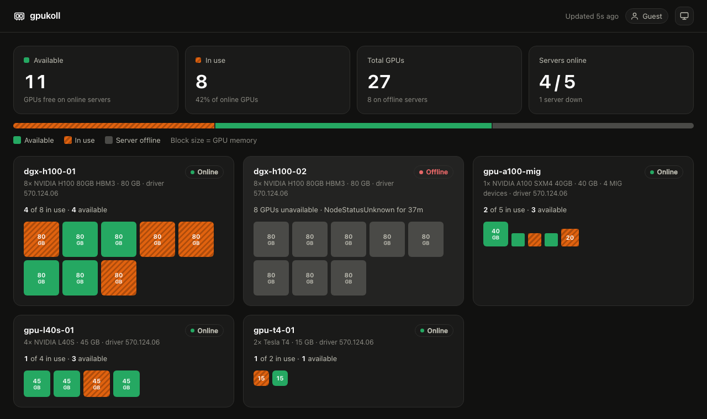

# gpukoll

A small web page that shows the GPU servers in a Kubernetes or OpenShift
cluster running the NVIDIA GPU Operator: how many GPUs there are, how many
are in use, and which servers are online.



- Each server is a frame. Each GPU is a block: green is available, orange
  (striped) is in use, grey means the server is offline, dashed means the
  server is up but its DCGM exporter could not be read. Block area follows
  GPU memory.
- No login. Every visitor is an anonymous, read-only guest.
- Light and dark mode (follows the OS, or pick one with the button top right).

## How it works

gpukoll lists the nodes and scrapes each GPU node's DCGM exporter (default
every 10s) and keeps the result in memory, so the load does not grow with
the number of viewers.

| What | Where it comes from |
|------|---------------------|
| GPU servers | nodes labelled `nvidia.com/gpu.present=true` or with `nvidia.com/gpu` capacity |
| GPU count | node capacity `nvidia.com/gpu`, falling back to label `nvidia.com/gpu.count` |
| Model, memory, driver | GPU Feature Discovery labels `nvidia.com/gpu.product`, `nvidia.com/gpu.memory`, `nvidia.com/cuda.driver-version.full` |
| GPUs in use | DCGM exporter metrics: a GPU whose series has a `pod` label is allocated to a pod |
| Online | node `Ready` condition is `True` |

The exporter must run with `DCGM_EXPORTER_KUBERNETES=true`, which the GPU
Operator sets by default. gpukoll finds the exporter pods through the
EndpointSlices of the `nvidia-dcgm-exporter` Service and connects to them on
their pod IPs, port 9400.

MIG shows one block per MIG device, for both the `single` and the `mixed`
strategy. With time-slicing (`nvidia.com/gpu.replicas`), a GPU counts as in
use when any of its slices is taken.

## Helm chart

```bash
helm install gpukoll oci://ghcr.io/mnorrsken/charts/gpukoll \
  --namespace gpukoll --create-namespace
```

The chart creates a ClusterRole with `list` on `nodes`, and a Role with
`list` on `endpointslices` in the DCGM exporter namespace. gpukoll cannot
read pods. No Secret is needed.

Set `dcgm.namespace` to where the GPU Operator runs. The default is
`nvidia-gpu-operator` (OpenShift); the upstream Helm chart uses
`gpu-operator`.

If that namespace has NetworkPolicies selecting the exporter pods, set
`networkPolicy.enabled=true` and the chart adds one there that allows
gpukoll in on port 9400. Leave it off when the namespace has no policies:
a policy isolates the pods it selects, so it would block other scrapers
such as Prometheus. The user running `helm install` needs rights to create
NetworkPolicies in that namespace. `networkPolicy.exporterPodLabels`
(default `app: nvidia-dcgm-exporter`) and `networkPolicy.exporterPort`
(default `9400`) must match the exporter pods.

On **OpenShift** a Route with edge TLS is created automatically (the chart
checks for `route.openshift.io/v1`). The pod sets no `runAsUser`, so it
runs under the default `restricted-v2` SCC. To set the hostname:

```bash
helm install gpukoll oci://ghcr.io/mnorrsken/charts/gpukoll \
  --namespace gpukoll --create-namespace \
  --set route.host=gpukoll.apps.example.com
```

On other clusters, enable the Ingress:

```yaml
ingress:
  enabled: true
  className: nginx
  hosts:
    - host: gpukoll.example.com
      paths:
        - path: /
          pathType: Prefix
```

Other values: `config.interval` (poll interval, default `10s`), `dcgm.service`
(default `nvidia-dcgm-exporter`), `route.enabled`,
`rbac.create`, plus the usual `image`, `resources`, `nodeSelector`,
`tolerations`, `affinity`.

With `helm template`, pass `--api-versions route.openshift.io/v1/Route` to
render the Route.

## Development

```bash
make test
kubectl proxy &      # port 8001
make run             # http://localhost:8080
```

Pod IPs are not reachable from a laptop, so `make run` passes `-dcgm-proxy`,
which scrapes the exporters through the API server's pod proxy (needs
`pods/proxy` in the exporter namespace).

`make docker-build` builds the image, `make helm-lint` checks the chart.
